# Architecture & Dependency Map — Phase 01: Scaffold & Motion Engine

> **Generated:** 2026-09-30  
> **Tool:** Graphify AST & Knowledge Graph Engine  
> **Scope:** `src/` core directory, Zustand stores, Framer Motion engine, and design tokens  
> **Status:** Healthy — 0 Import Cycles Detected  

---

## 1. Visual Architecture & Dependency Graph

```mermaid
graph TD
    %% Global Styles & Config
    subgraph STYLES["Design System & Motion Engine"]
        FONTS["src/styles/fonts.css"]
        MOTION["src/styles/motion.ts<br/><i>(tapSpring, modalMotion, tabLayoutTransition)</i>"]
        TAILWIND["tailwind.config.js<br/><i>(lumiere palette tokens & shadows)</i>"]
    end

    %% Types
    subgraph TYPES["Type Contracts (src/types/)"]
        T_TABLE["table.ts<br/><i>TableData, DiningZone, TableStatus, GuestProfile</i>"]
        T_ORDER["order.ts<br/><i>DiningOrder, OrderItem, OrderStatus</i>"]
        T_RES["reservation.ts<br/><i>Reservation</i>"]
    end

    %% Stores
    subgraph STORES["State Management (src/store/)"]
        S_FLOOR["useFloorStore.ts<br/><i>activeZone, selectedTableId, tables</i>"]
        S_ALERT["useAlertStore.ts<br/><i>alerts, dismissAlert, markAsRead</i>"]
    end

    %% Common Components
    subgraph COMMON["Common Components (src/components/common/)"]
        C_BADGE["Badge.tsx<br/><i>emerald, amber, brass, terracotta, neutral</i>"]
        C_BTN["ActionButton.tsx<br/><i>touch ergonomic + tapSpring</i>"]
        C_MODAL["ModalShell.tsx<br/><i>modalMotion + AnimatePresence</i>"]
        C_HEADER["Header.tsx<br/><i>brand serif, covers, tabular clock, shift alerts</i>"]
    end

    %% Floor Components
    subgraph FLOOR["Floor Module (src/components/floor/)"]
        F_CARD["TableCard.tsx<br/><i>guest profile, VIP tier, course timer, alert badge</i>"]
        F_FILTER["ZoneFilter.tsx<br/><i>animated pill via tabLayoutTransition</i>"]
        F_GRID["FloorGrid.tsx<br/><i>tablet responsive table layout</i>"]
    end

    %% Dispatch Components
    subgraph DISPATCH["Dispatch Module (src/components/dispatch/)"]
        D_CARD["OrderCard.tsx<br/><i>ticket items, fire next, course badges</i>"]
        D_BOARD["DispatchBoard.tsx<br/><i>kitchen pass synchronizer</i>"]
    end

    %% Cellar Components
    subgraph CELLAR["Cellar Module (src/components/cellar/)"]
        CL_ROW["StockRow.tsx<br/><i>vintage, bin allocation, stock status</i>"]
        CL_LEDGER["StockLedger.tsx<br/><i>grand reserve allocations</i>"]
    end

    %% Modals
    subgraph MODALS["Interactive Modals (src/components/modals/)"]
        M_FOLIO["GuestFolioModal.tsx<br/><i>VIP ledger, dietary alert, course progress</i>"]
        M_RUN["RunSheetModal.tsx<br/><i>covers booked, 86'd alerts, seating schedule</i>"]
    end

    %% Root
    subgraph ROOT["Root & Application Entry"]
        MAIN["src/main.tsx"]
        APP["src/App.tsx"]
    end

    %% Dependencies & Connections
    MAIN --> APP
    MAIN --> FONTS

    APP --> C_HEADER
    APP --> C_BADGE
    APP --> C_MODAL
    APP --> F_FILTER
    APP --> F_GRID
    APP --> D_BOARD
    APP --> CL_LEDGER
    APP --> M_FOLIO
    APP --> M_RUN
    APP --> S_FLOOR
    APP --> S_ALERT
    APP --> MOTION

    %% Store Connections
    S_FLOOR -.-> T_TABLE
    C_HEADER -.-> S_FLOOR
    C_HEADER -.-> S_ALERT
    C_HEADER -.-> C_BADGE
    C_HEADER -.-> MOTION

    %% Floor Connections
    F_FILTER -.-> MOTION
    F_FILTER -.-> T_TABLE
    F_GRID --> F_CARD
    F_GRID -.-> T_TABLE
    F_CARD --> C_BADGE
    F_CARD -.-> MOTION
    F_CARD -.-> T_TABLE

    %% Dispatch Connections
    D_BOARD --> D_CARD
    D_BOARD -.-> T_ORDER
    D_CARD --> C_BADGE
    D_CARD -.-> MOTION
    D_CARD -.-> T_ORDER

    %% Cellar Connections
    CL_LEDGER --> CL_ROW
    CL_ROW --> C_BADGE

    %% Modal Connections
    M_FOLIO --> C_MODAL
    M_FOLIO --> C_BADGE
    M_FOLIO --> C_BTN
    M_FOLIO -.-> T_TABLE
    M_RUN --> C_MODAL
    M_RUN --> C_BADGE
    M_RUN --> C_BTN

    %% Common Styling
    C_MODAL -.-> MOTION
    C_BTN -.-> MOTION
    C_BADGE -.-> TAILWIND
```



---

## 2. Graph Metrics & Topological Analysis

| Metric | Phase 01 Count | Architectural Assessment |
| :--- | :--- | :--- |
| **Total AST Nodes** | **162** | Full project symbols, types, interfaces, and JSX components indexed. |
| **Total Dependencies (Edges)** | **295** | Rich inter-component and store binding. |
| **Modular Communities** | **15** | High cohesion across discrete functional modules (`floor`, `dispatch`, `cellar`, `common`). |
| **Circular Dependencies / Cycles** | **0** | Clean acyclic dependency tree. No circular references detected. |
| **Extraction Integrity** | **100% EXTRACTED** | Deterministic AST parsing without guesswork. |

### Top 10 High-Centrality Hubs ("God Nodes")

These nodes represent the foundational building blocks of the LUMIÈRE Tablet OS:

1. **`Badge()` (15 inbound/outbound connections):** Used universally across TableCards, OrderCards, StockRows, Header, and Folio Modals to render tokenized state (emerald, amber, brass, terracotta).
2. **`App()` (13 connections):** Root orchestrator uniting Floor, Dispatch, and Cellar viewports.
3. **`TableData` contract (9 connections):** Shared interface anchoring stores, filters, table cards, and guest folio modals.
4. **`lucide-react` (9 connections):** Standardized SVG-native icon system.
5. **`framer-motion` & `tapSpring` (9 / 7 connections):** Central tactile interaction engine ensuring consistent ergonomic spring physics.
6. **`ModalShell()` (7 connections):** Reusable luxury backdrop & spring entrance shell.
7. **`useFloorStore` & `useAlertStore`:** Single sources of truth for active dining tables and sommelier/kitchen alerts.

---

## 3. Module & Dependency Cross-Reference

| Component / File | Purpose | Outgoing Dependencies | Key Consumers |
| :--- | :--- | :--- | :--- |
| [`src/App.tsx`](file:///c:/Users/aymen/OneDrive/Desktop/amex-waiter/src/App.tsx) | Master Tablet Container | `Header`, `FloorGrid`, `ZoneFilter`, `DispatchBoard`, `StockLedger`, `GuestFolioModal`, `RunSheetModal`, stores | `main.tsx` |
| [`src/components/common/Header.tsx`](file:///c:/Users/aymen/OneDrive/Desktop/amex-waiter/src/components/common/Header.tsx) | Tablet Status & Nav | `useAlertStore`, `useFloorStore`, `Badge`, `tapSpring` | `App.tsx` |
| [`src/components/common/Badge.tsx`](file:///c:/Users/aymen/OneDrive/Desktop/amex-waiter/src/components/common/Badge.tsx) | Luxury Token Indicator | `clsx`, `tailwind-merge` | `Header`, `TableCard`, `OrderCard`, `StockRow`, `GuestFolioModal`, `RunSheetModal`, `App` |
| [`src/components/common/ActionButton.tsx`](file:///c:/Users/aymen/OneDrive/Desktop/amex-waiter/src/components/common/ActionButton.tsx) | Touch Action Button | `framer-motion`, `tapSpring`, `clsx`, `tailwind-merge` | `GuestFolioModal`, `RunSheetModal` |
| [`src/components/common/ModalShell.tsx`](file:///c:/Users/aymen/OneDrive/Desktop/amex-waiter/src/components/common/ModalShell.tsx) | Dialog Container Shell | `framer-motion`, `modalMotion`, `tapSpring` | `GuestFolioModal`, `RunSheetModal`, `App.tsx` |
| [`src/components/floor/ZoneFilter.tsx`](file:///c:/Users/aymen/OneDrive/Desktop/amex-waiter/src/components/floor/ZoneFilter.tsx) | Quarter Navigation Filter | `framer-motion`, `tabLayoutTransition`, `table.ts` | `App.tsx` |
| [`src/components/floor/TableCard.tsx`](file:///c:/Users/aymen/OneDrive/Desktop/amex-waiter/src/components/floor/TableCard.tsx) | Interactive Table Tile | `Badge`, `tapSpring`, `table.ts` | `FloorGrid.tsx` |
| [`src/components/floor/FloorGrid.tsx`](file:///c:/Users/aymen/OneDrive/Desktop/amex-waiter/src/components/floor/FloorGrid.tsx) | Floor Layout Grid | `TableCard`, `table.ts` | `App.tsx` |
| [`src/components/dispatch/DispatchBoard.tsx`](file:///c:/Users/aymen/OneDrive/Desktop/amex-waiter/src/components/dispatch/DispatchBoard.tsx) | Kitchen Pass View | `OrderCard`, `order.ts` | `App.tsx` |
| [`src/components/cellar/StockLedger.tsx`](file:///c:/Users/aymen/OneDrive/Desktop/amex-waiter/src/components/cellar/StockLedger.tsx) | Sommelier Cellar Vault | `StockRow` | `App.tsx` |
| [`src/components/modals/GuestFolioModal.tsx`](file:///c:/Users/aymen/OneDrive/Desktop/amex-waiter/src/components/modals/GuestFolioModal.tsx) | Guest Dossier & Pacing | `ModalShell`, `Badge`, `ActionButton`, `table.ts` | `App.tsx` |
| [`src/components/modals/RunSheetModal.tsx`](file:///c:/Users/aymen/OneDrive/Desktop/amex-waiter/src/components/modals/RunSheetModal.tsx) | Shift Briefing Dialog | `ModalShell`, `Badge`, `ActionButton` | `App.tsx` |
| [`src/store/useFloorStore.ts`](file:///c:/Users/aymen/OneDrive/Desktop/amex-waiter/src/store/useFloorStore.ts) | Floor & Table Zustand Store | `table.ts`, `zustand` | `App.tsx`, `Header.tsx` |
| [`src/store/useAlertStore.ts`](file:///c:/Users/aymen/OneDrive/Desktop/amex-waiter/src/store/useAlertStore.ts) | Service Alerts Store | `zustand` | `App.tsx`, `Header.tsx` |
| [`src/styles/motion.ts`](file:///c:/Users/aymen/OneDrive/Desktop/amex-waiter/src/styles/motion.ts) | Tablet Touch Motion Engine | `framer-motion` | Common, floor, modal, and app components |

---

## 4. Visual Artifact Links

The following visual graph artifacts have been compiled and saved for browser inspection:

1. **[Interactive Force-Directed Graph](file:///c:/Users/aymen/OneDrive/Desktop/amex-waiter/doc/maintenance/phase-01-dependency-graph.html):**  
   `doc/maintenance/phase-01-dependency-graph.html` (or `graphify-out/graph.html`)  
   *Physics-simulated node graph with clustering, community filtering, and node search.*

2. **[Architecture & Call-Flow Map](file:///c:/Users/aymen/OneDrive/Desktop/amex-waiter/doc/maintenance/phase-01-callflow-map.html):**  
   `doc/maintenance/phase-01-callflow-map.html` (or `graphify-out/amex-waiter-callflow.html`)  
   *Sectioned Mermaid architectural diagrams with pan/zoom controls and call-flow tables.*

3. **[Collapsible Directory Tree](file:///c:/Users/aymen/OneDrive/Desktop/amex-waiter/doc/maintenance/phase-01-directory-tree.html):**  
   `doc/maintenance/phase-01-directory-tree.html` (or `graphify-out/GRAPH_TREE.html`)  
   *D3 collapsible radial/horizontal hierarchy of the codebase.*

4. **[Audit Report](file:///c:/Users/aymen/OneDrive/Desktop/amex-waiter/graphify-out/GRAPH_REPORT.md):**  
   `graphify-out/GRAPH_REPORT.md`  
   *Full health check, cohesion scores, and cross-community bridge analysis.*

---

## 5. Maintenance Runbook (Updating Graph on Future Phases)

After completing each subsequent phase (e.g., Phase 02: Table Management, Phase 03: Kitchen Dispatch, etc.):

1. **Update Graph Data:**
   ```powershell
   uv tool run --from graphifyy graphify extract . --code-only
   uv tool run --from graphifyy graphify cluster-only .
   ```
2. **Export Visual Artifacts:**
   ```powershell
   uv tool run --from graphifyy graphify export callflow-html
   uv tool run --from graphifyy graphify tree
   ```
3. **Archive to Maintenance Folder:**
   ```powershell
   Copy-Item "graphify-out/graph.html" "doc/maintenance/phase-XX-dependency-graph.html"
   Copy-Item "graphify-out/amex-waiter-callflow.html" "doc/maintenance/phase-XX-callflow-map.html"
   ```