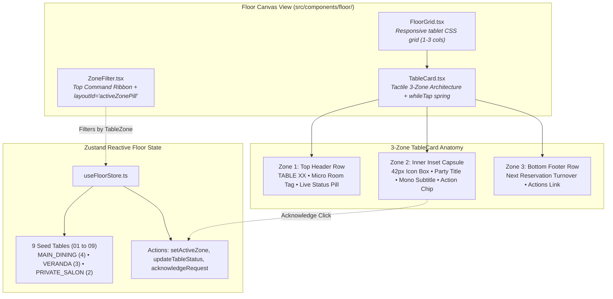

# Architecture & Dependency Map — Phase 02: 3-Zone Tactile Table Cards & Floor Canvas

> **Generated:** 2026-09-30  
> **Tool:** Graphify AST & Knowledge Graph Engine  
> **Scope:** Floor module, 3-zone TableCard, 9-table Zustand store, and active service alerts  
> **Status:** Healthy — 0 Import Cycles Detected  

---

## 1. Phase 02 Architectural Additions

---

## 2. Updated Metrics (Graphify AST)
- **Nodes:** 165 (+3 new contracts/actions)
- **Edges:** 301 (+6 new reactive bindings)
- **Communities:** 15 modular clusters
- **Import Cycles:** 0 (Acyclic)

---

## 3. Visual Artifacts
- **Interactive Graph:** [`doc/maintenance/phase-02-dependency-graph.html`](file:///c:/Users/aymen/OneDrive/Desktop/amex-waiter/doc/maintenance/phase-02-dependency-graph.html)
- **Call-Flow Map:** [`doc/maintenance/phase-02-callflow-map.html`](file:///c:/Users/aymen/OneDrive/Desktop/amex-waiter/doc/maintenance/phase-02-callflow-map.html)
- **Directory Hierarchy:** [`doc/maintenance/phase-02-directory-tree.html`](file:///c:/Users/aymen/OneDrive/Desktop/amex-waiter/doc/maintenance/phase-02-directory-tree.html)