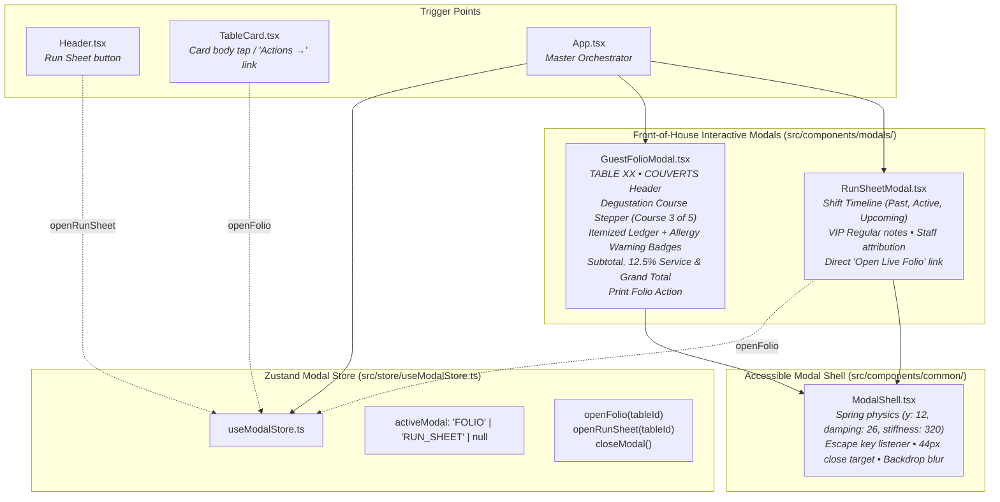

# Architecture & Dependency Map — Phase 03: Interactive Modals (Guest Folio & Table Run-Sheet)

> **Generated:** 2026-09-30  
> **Tool:** Graphify AST & Knowledge Graph Engine  
> **Scope:** Modal architecture, `ModalShell`, `GuestFolioModal`, `RunSheetModal`, and `useModalStore`  
> **Status:** Healthy — 0 Import Cycles Detected  

---

## 1. Phase 03 Architectural Additions

---

## 2. Updated Metrics (Graphify AST)
- **Nodes:** 169 (+4 new modal components, store contracts, and action triggers)
- **Edges:** 303 (+2 new state bindings)
- **Communities:** 15 modular clusters
- **Import Cycles:** 0 (Acyclic)

---

## 3. Visual Artifacts
- **Interactive Graph:** [`doc/maintenance/phase-03-dependency-graph.html`](file:///c:/Users/aymen/OneDrive/Desktop/amex-waiter/doc/maintenance/phase-03-dependency-graph.html)
- **Call-Flow Map:** [`doc/maintenance/phase-03-callflow-map.html`](file:///c:/Users/aymen/OneDrive/Desktop/amex-waiter/doc/maintenance/phase-03-callflow-map.html)
- **Directory Hierarchy:** [`doc/maintenance/phase-03-directory-tree.html`](file:///c:/Users/aymen/OneDrive/Desktop/amex-waiter/doc/maintenance/phase-03-directory-tree.html)